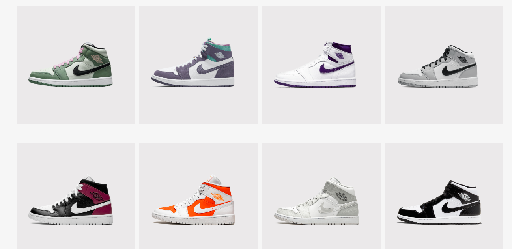

# Olá, tudo bem? 🖐

### Este e mais um desafio da comunidade do Iuri Silva (iuricode). Agora uma página com uma pegada um pouco mais de loja. Espero que gostem! ✌

## 📸 Fotos do projeto:

## Caso queira dar uma olhada: 
### <a href="https://hugocamposarimathea.github.io/Desafio-2/" target="_blank">Clique aqui</a>
### Ou aponte sua câmera para o QR Code abaixo: 

## 📧 Caso queira conversar:
  

    
     
  
 

